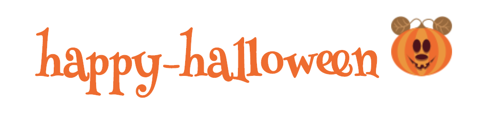

# 🎃 happy-halloween

[](https://app.netlify.com/sites/happy-halloween/deploys)




Want to celebrate Halloween in your site?

* Replace the mouse cursor with a tiny Pumpkin;
* Makes "boo" sounds when the user click a link/button.


## Demo

👉 [Try the demo](https://happy-halloween.netlify.app)

## How to use it

### npm / yarn

```sh
npm install happyhalloween.js
```

In the code:

```js
import 'happyhalloween.js'
```

### ...or...

1. Open the console
2. Copy paste `index.js`
3. Enjoy halloween 👻
